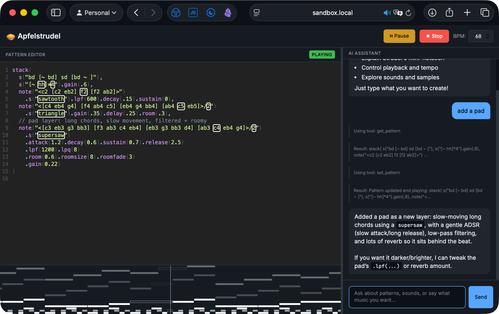

# 🥧 Apfelstrudel

<p align="center">
  
</p>

> Live coding music with AI assistance — powered by [Strudel.cc](https://strudel.cc) and [Bun](https://bun.sh)

Apfelstrudel combines the expressive power of Strudel's live coding environment with an AI agent that can help you create, modify, and understand music patterns in real time.

<p align="center">
  
</p>


## Features

- 🎵 **Strudel Integration** — Full Strudel.cc live coding environment
- 🤖 **AI Assistant** — Chat with an agent that understands music and patterns
- 🔄 **Real-time Control** — Agent can edit patterns, control playback, adjust tempo
- 🎨 **Dark Theme** — Easy on the eyes for those late-night sessions
- ⌨️ **Keyboard Shortcuts** — Ctrl+Enter to play, Ctrl+. to stop

## Quick Start

### Prerequisites

- [Bun](https://bun.sh) v1.0 or later
- OpenAI API key (or Azure OpenAI credentials)

### Installation

```bash
# Clone the repository
git clone https://github.com/rcarmo/apfelstrudel.git
cd apfelstrudel

# Install backend dependencies
make install

# Vendor frontend dependencies (Preact, HTM, Strudel)
make vendor

# Copy environment template
cp .env.example .env

# Edit .env with your API credentials
```

### Configuration

Create a `.env` file with your LLM credentials:

```bash
# OpenAI
OPENAI_API_KEY=sk-...

# Or Azure OpenAI
AZURE_OPENAI_ENDPOINT=https://your-resource.openai.azure.com
AZURE_OPENAI_KEY=...
AZURE_OPENAI_DEPLOYMENT=gpt-4o-mini

# Optional settings
APFELSTRUDEL_PROVIDER=openai  # or "azure"
APFELSTRUDEL_MODEL=gpt-4o-mini
APFELSTRUDEL_MAX_STEPS=16
PORT=3000
```

### Running

```bash
# Development mode with hot reload
make dev

# Production mode
make start
```

Open http://localhost:3000 in your browser.

## Usage

### Pattern Editor (Left Panel)

Write Strudel patterns using mini-notation:

```javascript
// Basic drum pattern
s("bd sd:2 bd bd sd").bank("RolandTR808")

// Melodic pattern
note("c3 e3 g3 b3".fast(2)).sound("sawtooth")
  .lpf(800).lpq(5)

// Stacked patterns
stack(
  s("bd*4"),
  s("~ hh*2"),
  note("c2 g2".slow(2)).sound("sawtooth")
)
```

### AI Assistant (Right Panel)

Ask the assistant to help you:

- "Make a chill lo-fi beat"
- "Add some hi-hats to the pattern"
- "Make it faster"
- "Explain what this pattern does"
- "What samples are available?"

### Keyboard Shortcuts

| Shortcut | Action |
|----------|--------|
| `Ctrl+Enter` | Play pattern |
| `Ctrl+.` | Stop |
| `Enter` | Send chat message |
| `Shift+Enter` | New line in chat |

## Development

```bash
# Run all checks (lint + typecheck + test)
make check

# Individual commands
make lint      # Run biome linter
make format    # Format code
make typecheck # TypeScript type checking
make test      # Run tests

# Build for production
make build

# Clean build artifacts
make clean
```

## Project Structure

```
apfelstrudel/
├── src/
│   ├── server/         # Bun HTTP + WebSocket server
│   │   ├── index.ts    # Main server entry
│   │   └── websocket.ts # WebSocket handlers
│   ├── agent/          # LLM agent implementation
│   │   ├── runner.ts   # Agentic loop
│   │   ├── llm.ts      # LLM client (OpenAI/Azure)
│   │   └── system-prompt.ts
│   ├── tools/          # Agent tools
│   │   ├── pattern.ts  # get/set/modify pattern
│   │   ├── transport.ts # play/stop/evaluate
│   │   ├── tempo.ts    # tempo control
│   │   ├── reference.ts # strudel help & samples
│   │   └── todo.ts     # task management
│   └── shared/         # Shared types
│       └── types.ts
├── public/             # Static frontend
│   ├── index.html
│   ├── styles.css
│   └── app.js
├── SPEC.md            # Detailed specification
├── Makefile
└── package.json
```

## Agent Tools

The AI assistant has access to these tools:

| Tool | Description |
|------|-------------|
| `get_pattern` | Read current pattern code |
| `set_pattern` | Replace pattern code |
| `modify_pattern` | Insert code before/after existing pattern |
| `play_music` | Start playback |
| `stop_music` | Stop playback |
| `strudel_evaluate` | Evaluate code without changing editor |
| `set_tempo` | Adjust BPM |
| `get_strudel_help` | Query Strudel documentation |
| `list_samples` | List available samples |
| `manage_todo` | Track tasks and ideas |

## Architecture

```
┌──────────────────────────────────────────────────────────┐
│                      Browser                              │
│  ┌─────────────────────┐  ┌────────────────────────────┐ │
│  │   Strudel Editor    │  │      Chat Sidebar          │ │
│  │  (CodeMirror)       │  │  (WebSocket messages)      │ │
│  └─────────────────────┘  └────────────────────────────┘ │
│             │                        │                    │
└─────────────┼────────────────────────┼────────────────────┘
              │ WebSocket              │
              ▼                        ▼
┌──────────────────────────────────────────────────────────┐
│                    Bun Server                             │
│  ┌─────────────────────┐  ┌────────────────────────────┐ │
│  │   Static Files      │  │    WebSocket Handler       │ │
│  └─────────────────────┘  └────────────────────────────┘ │
│                                      │                    │
│                                      ▼                    │
│                           ┌────────────────────────────┐ │
│                           │     Agent Runner           │ │
│                           │  (Agentic Loop + Tools)    │ │
│                           └────────────────────────────┘ │
│                                      │                    │
└──────────────────────────────────────┼────────────────────┘
                                       │
                                       ▼
                              ┌────────────────┐
                              │  OpenAI / Azure │
                              │     LLM API     │
                              └────────────────┘
```

## Vendored Samples

Audio samples from the [Dirt-Samples](https://github.com/tidalcycles/Dirt-Samples) library (218 instruments, ~2000 files) are vendored in `public/vendor/strudel/samples/dirt/` for offline convenience. These samples were created by the [TidalCycles](https://tidalcycles.org) community and are redistributed here temporarily to enable fully offline operation.

Fonts ([Inter](https://rsms.me/inter/) by Rasmus Andersson, [JetBrains Mono](https://www.jetbrains.com/lp/mono/) by JetBrains) are also vendored locally in `public/vendor/fonts/`.

If you are packaging or forking this project, please review the upstream licenses for these assets.

## License

AGPL-3.0 — Required by Strudel.cc dependency.

See [LICENSE](LICENSE) for details.

## Credits

- [Strudel.cc](https://strudel.cc) by Felix Roos — The amazing live coding environment
- [Dirt-Samples](https://github.com/tidalcycles/Dirt-Samples) by the TidalCycles community — Audio samples
- [Inter](https://rsms.me/inter/) by Rasmus Andersson — UI typeface
- [JetBrains Mono](https://www.jetbrains.com/lp/mono/) by JetBrains — Editor typeface
- [Bun](https://bun.sh) — Fast JavaScript runtime
- Inspired by [rcarmo/steward](https://github.com/rcarmo/steward) — Tool harness pattern

---

Made with 🥧 and 🎵
